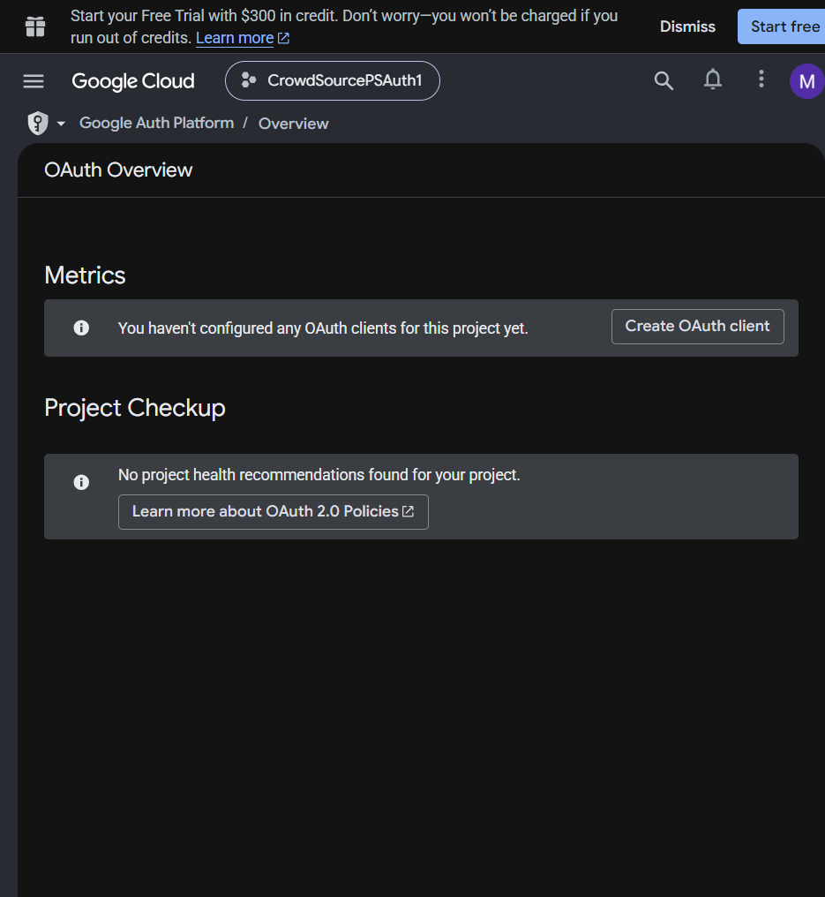
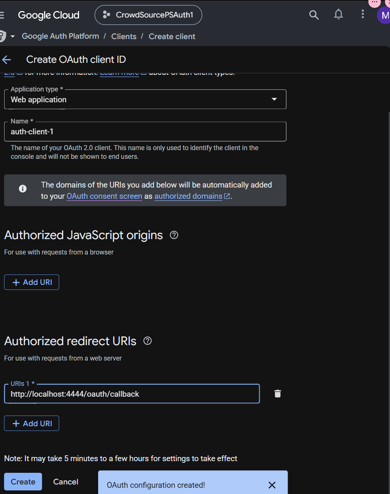

This Node.js/Express implementation demonstrates the **Authorization Code Grant Flow** using modern standard `fetch`.

**1. Code Implementation (`server.js`)**

```javascript
import express from 'express';

const app = express();
const PORT = 3000;

// Configuration from Google Cloud Console
const CLIENT_ID = process.env.GOOGLE_CLIENT_ID || 'YOUR_CLIENT_ID';
const CLIENT_SECRET = process.env.GOOGLE_CLIENT_SECRET || 'YOUR_CLIENT_SECRET';
const REDIRECT_URI = 'http://localhost:3000/oauth/callback';

// Step 1 & 2: Redirect user to Google's OAuth 2.0 endpoint
app.get('/login', (req, res) => {
  const authUrl = new URL('https://accounts.google.com/o/oauth2/v2/auth');
  authUrl.searchParams.append('client_id', CLIENT_ID);
  authUrl.searchParams.append('redirect_uri', REDIRECT_URI);
  authUrl.searchParams.append('response_type', 'code');
  authUrl.searchParams.append('scope', 'openid email profile');
  authUrl.searchParams.append('access_type', 'offline'); // Requests a refresh_token
  authUrl.searchParams.append('prompt', 'consent');     // Forces consent prompt for demo

  res.redirect(authUrl.toString());
});

// Step 3 & 4: Receive authorization code & exchange it for tokens
app.get('/oauth/callback', async (req, res) => {
  const { code } = req.query;

  if (!code) {
    return res.status(400).send('Error: Authorization code not provided.');
  }

  try {
    // Exchange the code for Access Token and Refresh Token
    const tokenResponse = await fetch('https://oauth2.googleapis.com/token', {
      method: 'POST',
      headers: { 'Content-Type': 'application/x-www-form-urlencoded' },
      body: new URLSearchParams({
        code: code.toString(),
        client_id: CLIENT_ID,
        client_secret: CLIENT_SECRET,
        redirect_uri: REDIRECT_URI,
        grant_type: 'authorization_code',
      }),
    });

    const tokens = await tokenResponse.json();

    if (!tokenResponse.ok) {
      return res.status(tokenResponse.status).json(tokens);
    }

    // Step 6: Use access_token to request user profile from Google Resource Server
    const userResponse = await fetch('https://www.googleapis.com/oauth2/v2/userinfo', {
      headers: { Authorization: `Bearer ${tokens.access_token}` },
    });

    const userData = await userResponse.json();

    res.json({
      message: 'Successfully authenticated!',
      tokens: {
        access_token: tokens.access_token,
        refresh_token: tokens.refresh_token,
        expires_in: tokens.expires_in,
      },
      user: userData,
    });
  } catch (error) {
    res.status(500).json({ error: error.message });
  }
});

app.listen(PORT, () => {
  console.log(`Server running on http://localhost:${PORT}`);
  console.log(`Visit http://localhost:${PORT}/login to start the flow`);
});

```

---

**2. Execution Steps**

* Install dependencies:
```bash
npm init -y
npm install express

```


* Add `"type": "module"` to your `package.json`.
* Replace `YOUR_CLIENT_ID` and `YOUR_CLIENT_SECRET` with credentials from the **Google Cloud Console** (under Web Application client type).
* Ensure `http://localhost:3000/oauth/callback` is added to your **Authorized Redirect URIs** in Google Cloud Console.
* Start the application and navigate to `http://localhost:3000/login`.

---
Close, but not quite—that link leads specifically to Cloud Storage documentation. To get your OAuth credentials, you need the main **Google Cloud Console** dashboard under **APIs & Services**.

**Quick Path to OAuth Credentials**

1. Go directly to **[console.cloud.google.com](https://console.cloud.google.com/)**.
2. Select an existing project (or click **Select a project** > **New Project** at the top bar).
3. Open the left navigation menu (☰) and go to **APIs & Services** > **Credentials**.
4. Click **+ Create Credentials** at the top and select **OAuth client ID**.
5. Configure your **OAuth consent screen** first if prompted (select *External*, add app name and user support email).
6. Select **Web application** as the application type, name it, and add `http://localhost:3000/oauth/callback` under **Authorized redirect URIs**.
7. Click **Create** to generate and copy your **Client ID** and **Client Secret**.



but i havecreated the oauth configuration and now 'In the left sidebar under APIs & Services, click OAuth consent screen.' shows this screen, what to do now for changing the app type and also the add users thingy

---
You are on the right track—the consent screen setup is complete! You are now on the **OAuth Overview** page.

**1. Set the Application Type & Get Credentials**

* Click the **Create OAuth client** button on the right side of your screen (inside the *Metrics* box).
* In the **Application type** dropdown, select **Web application**.
* Enter a **Name** (e.g., `Node Web App`).
* Under **Authorized redirect URIs**, click **+ Add URI** and enter:
`http://localhost:3000/oauth/callback`
* Click **Create** at the bottom. A popup will show your **Client ID** and **Client Secret**.

---

**2. Add Test Users**

* In the left sidebar under *Google Auth Platform*, click **Audience** (or **OAuth consent screen**).
* Scroll down to the **Test users** section.
* Click **+ Add Users** and type your Gmail address so Google allows your account to log in during development.
* Click **Save**.

---



